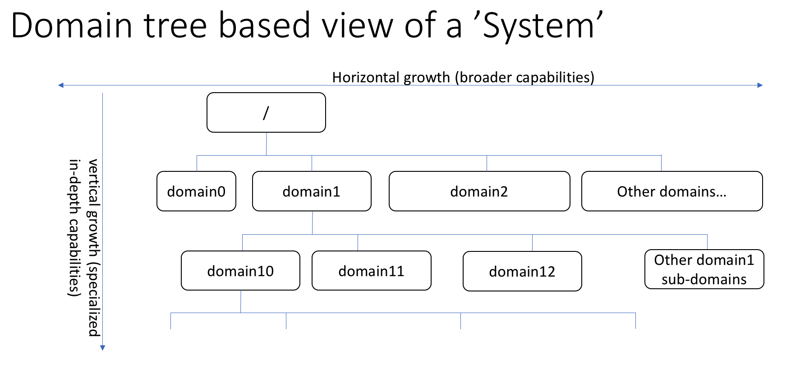

The Java platform has quite a lot of well known and mature frameworks out in the wild. Then why do we need yet another one? you may ask.

Here we layout the core philosophy behind the Molecule framework and the reasons as to Why yet another framework?

## Software Systems - Conceptual view
A Software system, is essentially a system irrespective of whether it is a distributed system or a non-distributed one.
Molecule is based on the fundamental idea that a Software system at a very high level has a logical boundary called the 'domain' and which inturn can be logically composed of one or more 'sub-domain's.
Whether the software system is an 'operational system' , 'translator / transformer' or a 'driver' it always is intended to solve a problem in the context of a 'domain'. 
From this perspective any software system can be thought to be composed of one or more 'domains' or 'areas' and a collection of operations on those domains.

### Domain
In Molecule terminology, a 'Domain' represents an 'area' or 'space' which serves as a container for 'operations' which are meaningful within that 'domain'.

### Sub Domain
A 'Sub Domain' is a 'Domain' except that it has one logical parent 'Domain'.

### Domain Operations
A Domain Operation , 'operation' for short represents a logical activity within the context of the 'Domain'. An 'operation' may optionally expect an 'input' and may optionally produce an 'output'.

The above concepts are explicit within Molecule and we firmly believe that this 'mental model' of software system decomposition, though it exists 'on paper' for every piece of software which was and will ever be written, is worth-while to expose to the software system's developer.

In this context the 'user' of the Molecule framework will be exposed to these fundamental concepts when developing his / her software using the Molecule Framework.

### Domain Tree based view of a 'System'
The below diagram serves to illustrate this perspective of a 'System' which we call the 'Domain Tree' in Molecule Terminology.

The domain tree view provides an abstract view of a system built on Molecule framework.
This form of decomposition of a software system provides the ability to 'grow' and evolve the software system overtime in both the horizontal and vertical dimensions.
The Horizontal dimension represents the dimension of capability of the system as it grows and becomes bigger in term of domains covered.
The Vertical dimension represents the dimension of capability of the system as it grows and becomes deeper in terms of sub-domains covered from it current state.

### Example Domain Tree view of a fictional 'Accounting System'
The below illustration provides a possible domain decomposition of a fictional 'Accounting System'.
The '/' of the inverted tree represents the 'accounting' domain implicitly.

