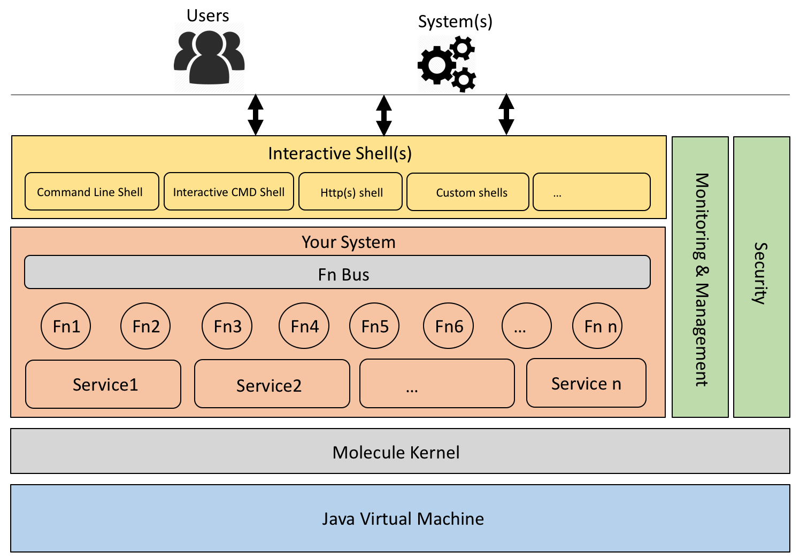
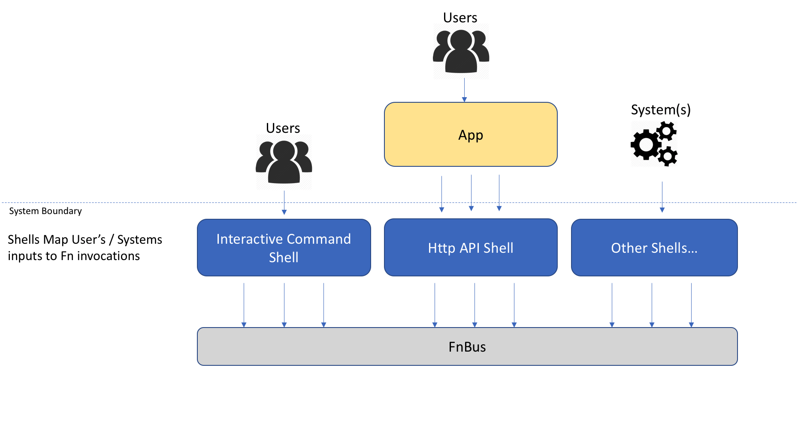

Since Molecule is just a 'library', developers can use it to build systems following any architectural style.
Be it monolithic or micro service based application. Or a simple command line application, Molecule provides the concepts 
to build any such system. Molecule is built on the JAVA platform and relies heavily on the Java and JVM ecosystem for a lot of its functioning.
The below logical architecture describes the structure of a Molecule based system running on a single JVM process.

## Molecule based System's Logical Architecture
The below diagram illustrates the conceptual view of systems built using the molecule framework

Now lets briefly discuss the key aspects of the logical architecture.

### Key Components
A system build using Molecule framework will follow a layered architecture. Each layer / a block has a specific purpose and works in collboration with the other services provided by the Molecule framework.

### Molecule Kernel
The Molecule kernel is the minimal runtime required by anyone who wants to program on the Molecule Framework.
The Molecule kernel provides all the capabilities for developers to create composable Systems.
For an indepth view of the kernel please check out the [internals of molecule](./all-about-molecule-kernel)

### Your System
Your system here refers to the system you will build using the Molecule framework. Your system will typically be composed of a set of entities called Fns and services (discussed further down below). Each Fn could use the services in the service layer to achieve its functionality. The framework relies on the excellent dependency injection library [Google Guice](https://github.com/google/guice) to provide dependency injection as well as act as the module framework as well. All of Molecules framework is built as Guice Modules. Moreover we encourage you to build your system using the same modular principles which Google Guice enables.
For an indepth view of the key principles which molecule follows within the framework please check out the [modularity in Molecule framework](./modularity-in-molecule)

#### Fns
Fns (pronounced 'Funs") is molecule's core building block. All of a system's functionality is built using this humble building block. Fn is the function's equivalent in Molecule terminology. Fn takes a Param as input and returns a Param as output. For an indepth view of the design of the Molecule kernel please check out the [Kernel design](./all-about-molecule-kernel)

#### FnBus
The FnBus is a special Fn which provides the capability to execute other Fns registered by various modules in the system. The FnBus itself is provided to your system as a standard kernel service. The Fn Bus maintains a list of registered Fn instances within the system and takes care of delegating and executing requests to those Fns. This design allows the encapsulation of the execution of Fn. The FnBus (depending on the implementation) is free to decide whether to use kernel thread pool to execute the Fn specified or to use the calling thread to execute the specified Fn. This design also allows FnBus to execute Fns in parallel to reduce the time taken to execute multiple Fns.

#### Services
The Services are supporting capabilities which can be provided by the kernel or your dependent modules. Services are POJOs which implement a well defined Interface.

#### Shells
The Shell is a logical entity which provides the capability for users / other systems to interact with the system. You can think of the shell as the interactive layer / abstraction provided by the system for it to be used effectively. In that sense the below are all considered as a 'Shell' in Molecule terminology.
1. Command line interface
2. Http API interface
3. Interactive Command line interface
4. RMI Interface

The primary function of a shell is to map the information provided by the user / system on one end to a Fn to be executed then render the output of the Fn in such a way the user / system can consume / understand it.

The below illustration captures the essence of a Shell's function within the context of a system built on the Molecule Framework.

