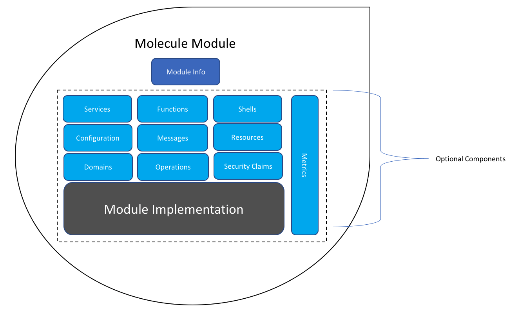

In this article let's discuss about what is meant to be a well behaved module in Molecule framework.

## Module as per Molecule
A module in molecule is represented by the abstract class MoleculeModule in the framework. A molecule module provides a set of capabilities and features along with an implementation of those capabilities. The Molecule framework internally uses the Google Guice Module framework for all of its Module capabilities. MoleculeModule class is an extension of the AbstractModule in the Guice framework.

The below illustration provides a pictorial view of what it means to be a module in the framework.

Lets briefly discuss the key components and their purpose below:

### ModuleInfo
Every guice module in a system using Molecule framework, is expected to provide a data structure called ModuleInfo. This ModuleInfo contains some meta information about the module itself. At present the below are the key information contained in ModuleInfo.
1. Module Name
2. Module Vendor
3. Module Version
4. A set of module specific attributes

If the guice module extends the MoleculeModule class in the framework, then the ModuleInfo can be automatically picked up from the classpath under info/fully_qualified_module_class_name.json

### Services
Every module is expected to contribute a set of Services (singletons mostly). Services are simply POJOs which implements a well defined interface.

#### LifecycleManager Service
One important service which a module can optionally provide is the LifecycleManager. A LifecylceManager implementation is expected have the know-how of how to manage the lifecylce of all the services defined within the Module.

### Functions (Fns)
A Module can optionally provide a list of Fns to the System.

### Shells
A Module can optionally provide a list of Shell implementations to the System.

### Configuration
A Module can register a set of configuration information to the System.

### Messages
Similarly a Module can also register a set of message configuration info to the System.

### Resources
A Module can also provide arbitrary resources in to the system. These resources can be images, text and other type of resources which may be of use to other modules in the system.

### Metrics
Optionally Module can publish metric information to the environment, which can help in measurement and management of the Molecule System.

